# 🎬 FlixStream GPT

### 🎥 **Demo: click 👇👇**

[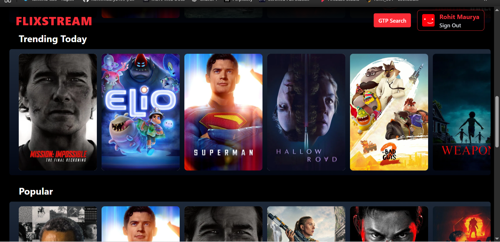](https://www.linkedin.com/posts/rohit139maurya_reactjs-vite-redux-activity-7363808256030371840-0bL5?utm_source=share&utm_medium=member_desktop&rcm=ACoAADiphM0Bd4-cygch_E3VXOoyvmcHKjrd4Yc)

[](LICENSE)
[](https://github.com/RohitMaurya139/FLIXSTREAM-GPT/stargazers)
[](https://github.com/RohitMaurya139/FLIXSTREAM-GPT/issues)
[](https://www.linkedin.com/in/rohit139maurya/)

---

## 📖 **About the Project**

**FlixStream GPT** is a **Netflix-inspired streaming platform** built with **React, Vite, Tailwind CSS, Redux, Firebase Authentication**, and **TMDB API**.  
It includes an **movie search** and a **multi-language feature** for a personalized experience.

---

### 🔑 **Key Highlights**

✅ **Modular Architecture** – Built with reusable components for clean & maintainable code.  
✅ **React Hooks** – Implemented `useState`, `useEffect`, `useRef`, `useDispatch`, `useSelector`, `useContext`, `useParams`.  
✅ **Redux Store** – Centralized state management for seamless data flow.  
✅ **Firebase Authentication** – Secure login & signup with email & password using Firebase methods.  
✅ **Form Validation** – Validated names, emails, and passwords for better UX.  
✅ **TMDB API** – Fetch movies by category & detailed information.  
✅ **YouTube API** – Fetch and display movie trailers.  
✅ **Tailwind CSS** – Styled with Tailwind CSS for a responsive and modern UI across all devices.

---

🎯 **Current Features:**  
✔ Search any movie worldwide, explore details, and watch trailers instantly!  
✔ Browse by categories with smooth UI and responsive design.

---

## 🔥 **Preview**

### 📸 **Screenshots**
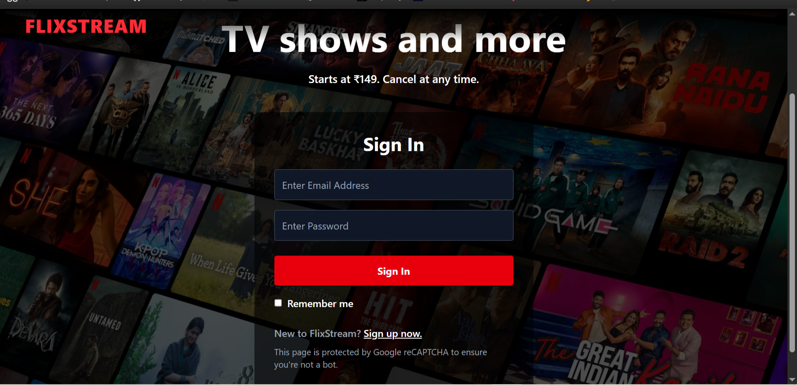
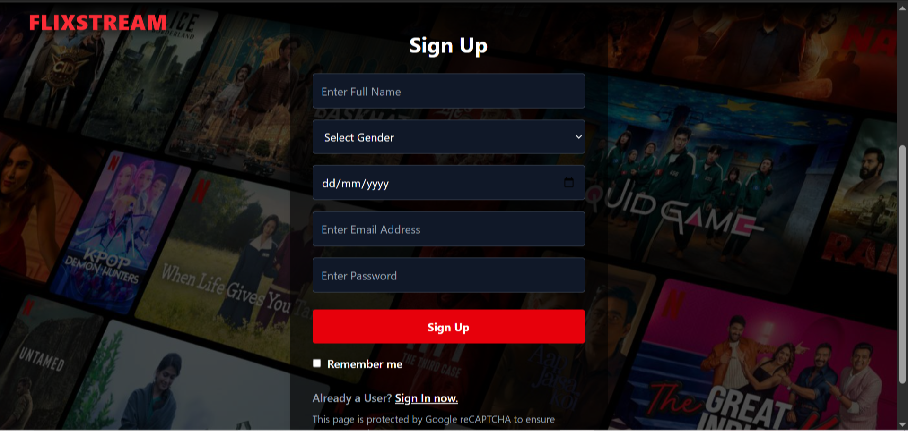
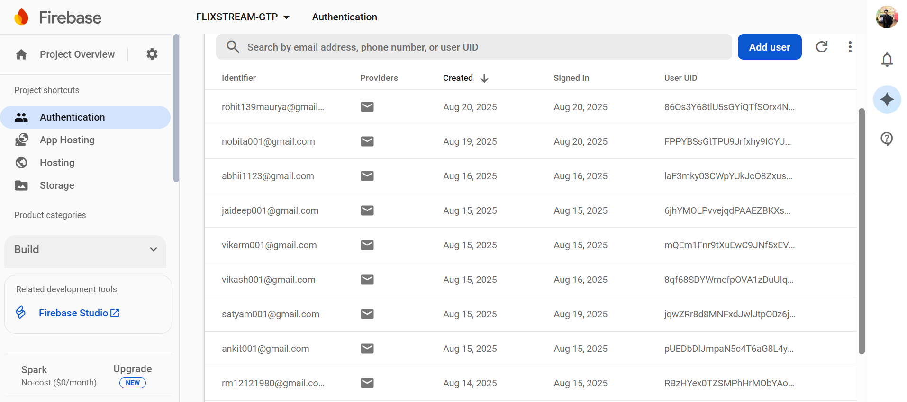
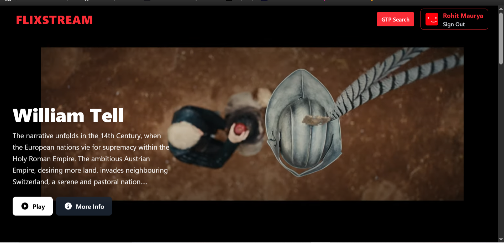

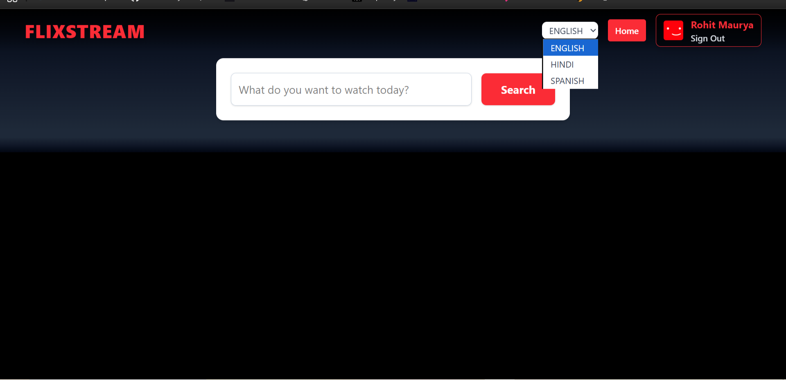
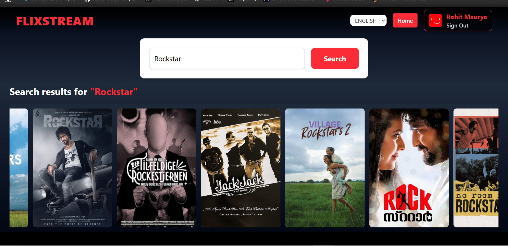
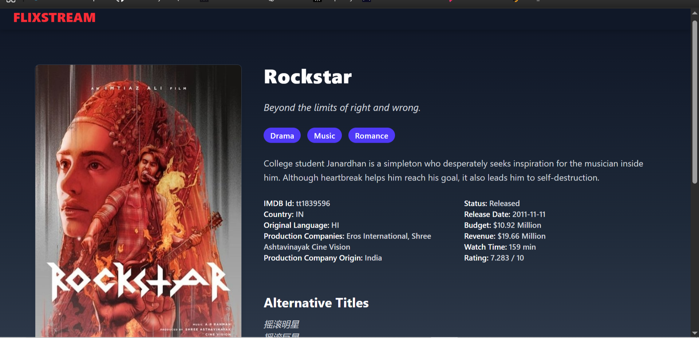
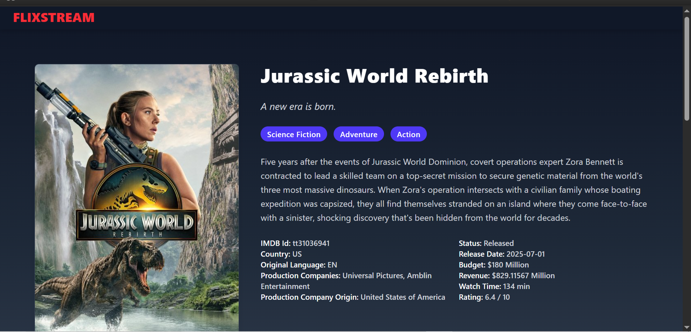
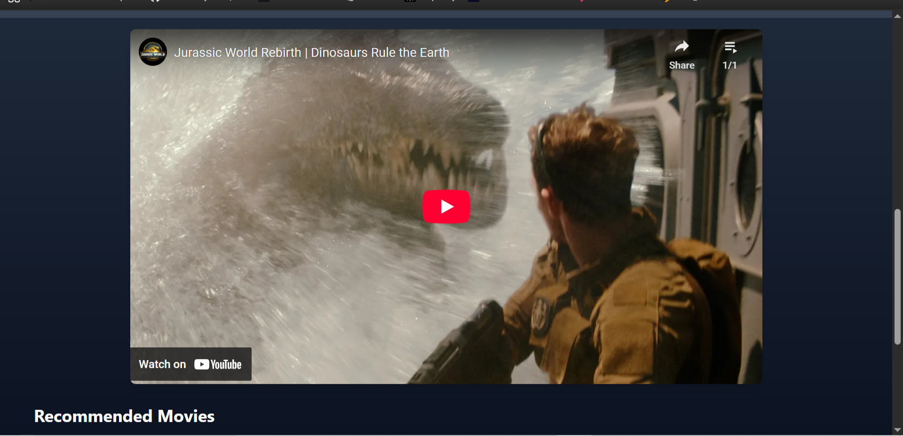
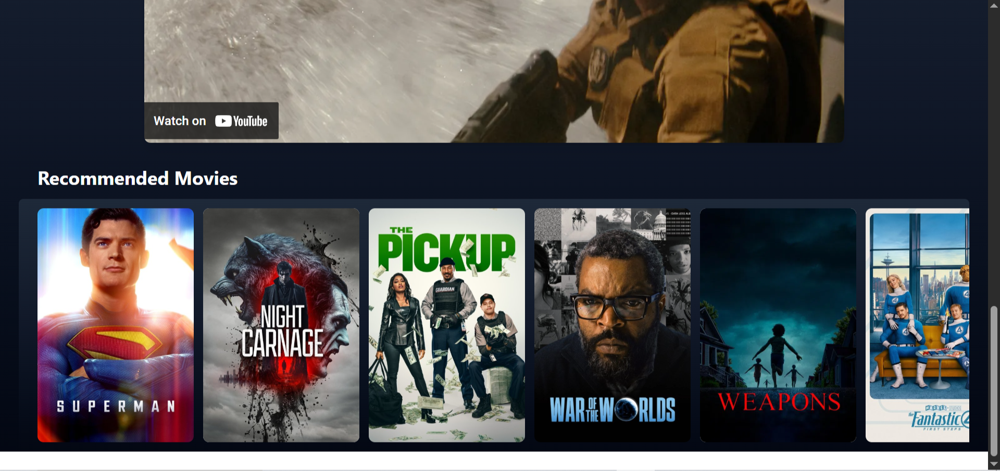

---

## ✅ **Features**

- **Authentication**
  - Sign In / Sign Up
  - Firebase-based secure login
- **Browse Page**
  - Hero section with movie trailer background
  - Trending, Popular, Now Playing movies
- **GPT Search**
  - Search any movie World Wide
- **Movie Details**
  - Watch Trailer
  - Recommended Movies
- **Multi-language Support**
- **Responsive UI**
- **Redux Store Management**
- **Environment Variables**
- **Deployed to Production**

---

## 🛠 **Tech Stack**

- **Frontend:** React, Vite, Tailwind CSS
- **State Management:** Redux Toolkit
- **Authentication:** Firebase Auth
- **API:** TMDB API (Movies)
- **Deployment:** Firebase Hosting

---

## 🚀 **Getting Started**

### **Prerequisites**

- Node.js (v16+)
- NPM or Yarn
- TMDB API Key
- Firebase Project

### **Installation**

Clone the repository:

```bash
git clone https://github.com/RohitMaurya139/FLIXSTREAM-GPT.git
cd FLIXSTREAM-GPT
```
